# Concepts

## Texts and structure

One instance of Tekst can handle one or more reference texts that can be selected from the user interface. Switching to a different reference text changes the working context of Tekst, including available resources, settings, etc.

Each text's structure has to be modeled in advance to lay the foundation for Tekst to work with it. The structure model of a text has to follow a clear hierarchical scheme of nested structure levels (e.g. "Series" contains "Book" contains "Chapter" contains "Paragraph" contains "Sentence").

Each structure level *must* be subordinate to *one* parent structure level and can have *at most one* direct child level. It is not possible to have two structure levels modeled as siblings under the same parent level.

!!! example
    A book's chapters may contain footnotes you'd want to model separately from the paragraphs contained in the chapters. This is not possible via the structure model. But you may very well just use a structure of "Chapter" containing "Paragraph" and associate resources containing resources on the footnotes to each location on the "Paragraph" level.

The reason for this limitation is the concept of exploratory browsing implemented by Tekst. For being able to skip through the locations on a certain structure level like you turn the pages of a book, there has to be both a clear hierarchy of structure levels as well as a sequencial order of the locations on each level.

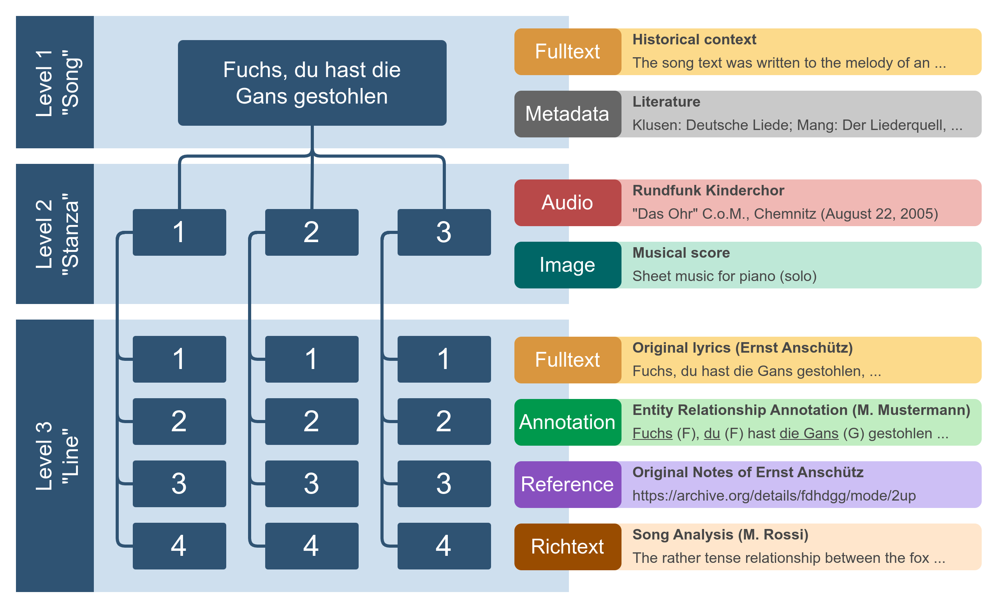

/// caption
Data model: Example of a simple song structure modeled for use as a reference work (or "text") in Tekst, with a selection of (partly imaginary) resources associated with each structure level. A resource may provide zero to one contents per location on its respective structure level.
///

## Collaboration

Tekst aims to encourage collaboration between parties with common backgrounds or interests, like researchers working with data on the same reference text. The goal of this collaboration is the creation of a common, central platform for relevant data resources concerning one or multiple (related) texts. With Tekst, research communities are able to:

- accumulate relevant resources on one online platform
- create and propose new resources for publication
- evaluate, compare and improve data created by other community members
- publish curated datasets to the broader public (which is a decision of the party operating the platform)
- offer different ways for accessing the data, like browsing contents along the texts structure, extensive search functionalities or exporting datasets in various formats
- maintain a close network of likeminded researchers

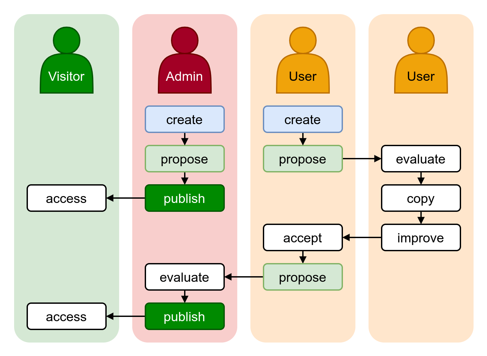

/// caption
Collaboration flow between administrators, registered users and visitors of the platform.
///

The administrator(s) operating the platform curate the resources that are visible to public visitors. A selected community of registered users is able to create and share datasets with each other, propose corrections or additions, stay up to date on each other's progress and maintain a cooperative relationship to other representatives of their field.

## Resource Types

### Plain Text

This very simple resource type may be used for plain (unstyled) textual data.

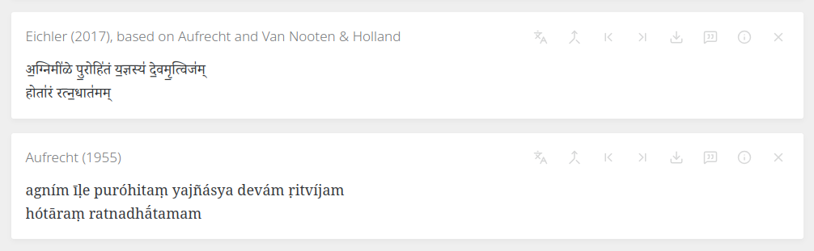

/// caption
Example screenshot taken from [VedaWeb](https://vedaweb.uni-koeln.de).
///

### Rich Text

This resource type is also meant for text, but with added formatting/styling capabilities. It is useful for longer sequences of textual data that have their own internal structure, like a short analysis, or, like in the screenshot below, a chord progression aligned to a song's lyrics.

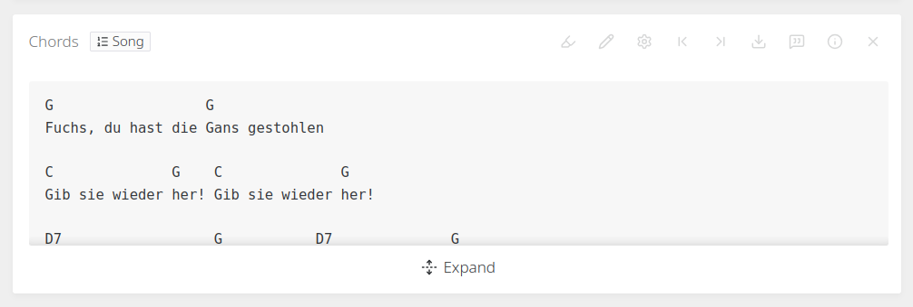

/// caption
Example screenshot taken from the Tekst development demo.
///

### Text Annotation

The Text Annotation resource type offers powerful functionality for annotating a sequence of tokens. Annotations can be grouped, colored and selectively displayed via a custom display template. The full set of annotations on a token can be viewed by clicking on the token itself, allowing for high-priority annotations to be displayed inline while less important ones are hidden.

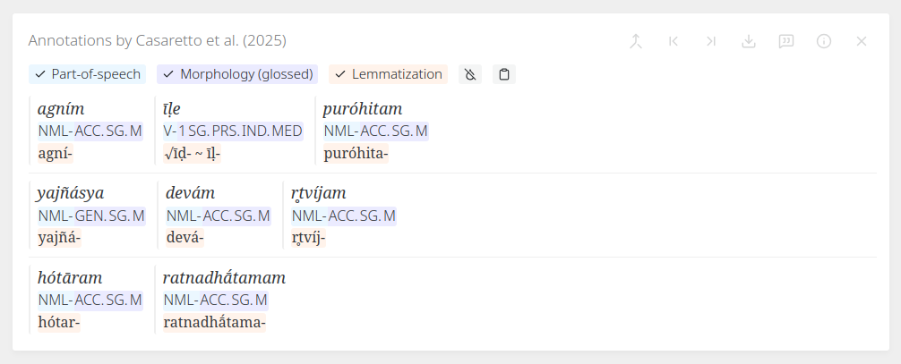

/// caption
Example screenshot taken from [VedaWeb](https://vedaweb.uni-koeln.de).
///

### External References

A simple way to link to external resources that are relevant to a certain text location.

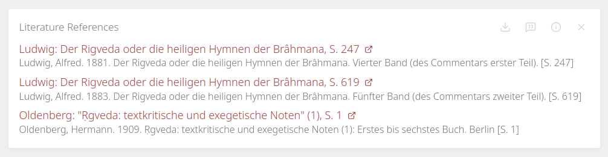

/// caption
Example screenshot taken from [VedaWeb](https://vedaweb.uni-koeln.de).
///

### Images

The "images" resource type is for displaying captioned images in a clean way. It offers a non-obtrusive lightbox/carousel view with zoom and rotation functionality.

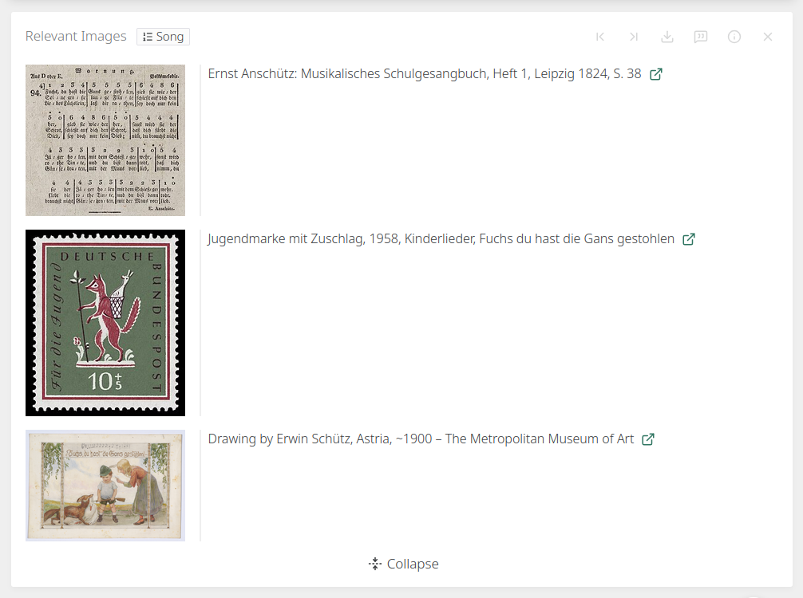

/// caption
Example screenshot taken from the Tekst development demo.
///

### Audio

This resource type shows one or more audio players per content that can be used to play audio files. If a resource content references multiple audio files, multiple players are shown and will play sequentially.

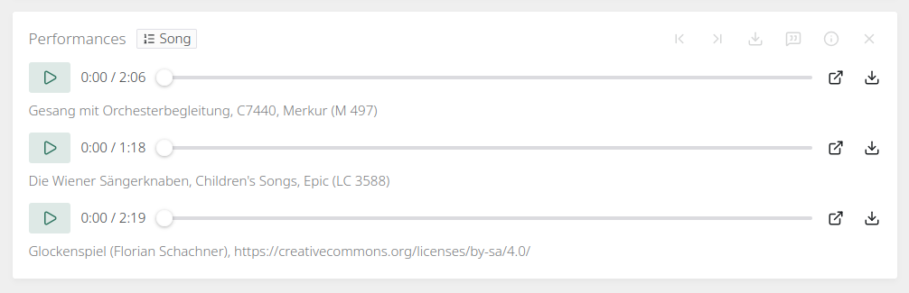

/// caption
Example screenshot taken from [VedaWeb](https://vedaweb.uni-koeln.de).
///

### Video

Work in progress...

### 3D

Work in progress...

### Location Metadata

This resource type is meant for holding basic key-value metadata on certain text locations. The data can be displayed as a normal resource content block (along all the other resource types' contents) or as tags embedded in the reading view's header.

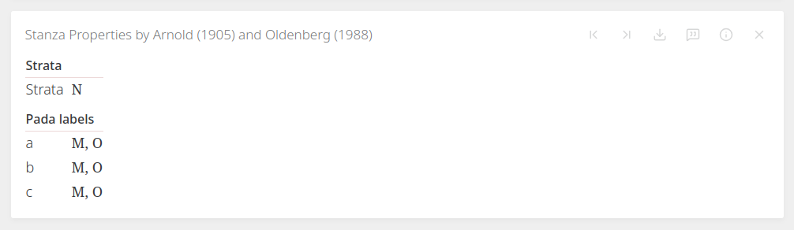

/// caption
Example screenshots taken from [VedaWeb](https://vedaweb.uni-koeln.de).
///

### API Call

The API Call resource type is meant to display the response of an API call after it has been transformed to HTML in a custom transformation funtion. This way, arbitrary data from remote APIs can be integrated into the platform.

!!! tip
    The API Call resource type is very powerful and meant to be used by advanced users with knowledge about HTTP APIs, JavaScript and/or other web technologies. Due to the potential harm that can be caused by misusing this resource type, its usage can be restricted to privileged users by the platform operator.

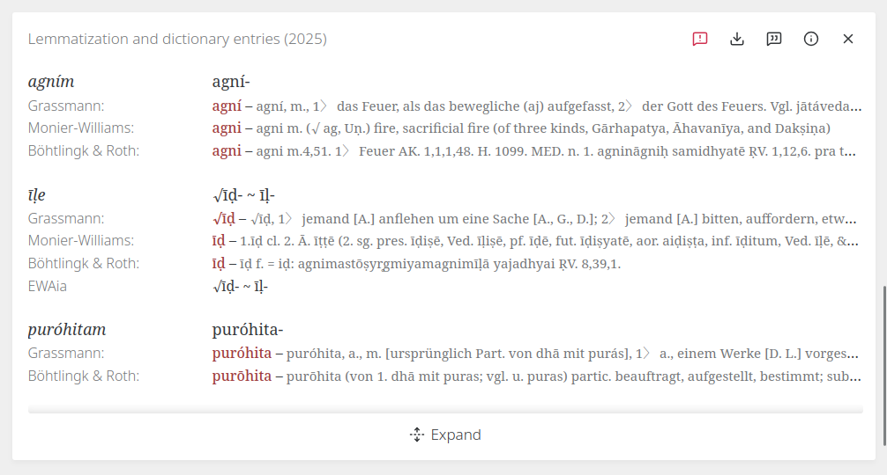

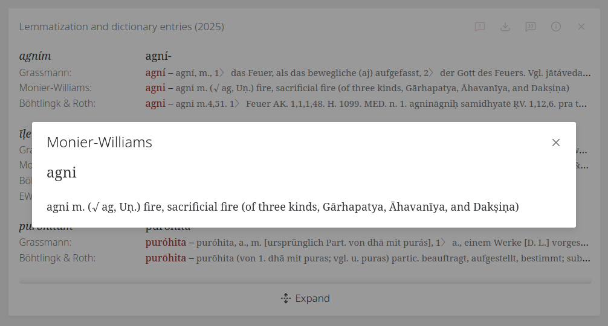

/// caption
Example screenshots taken from [VedaWeb](https://vedaweb.uni-koeln.de).
///
