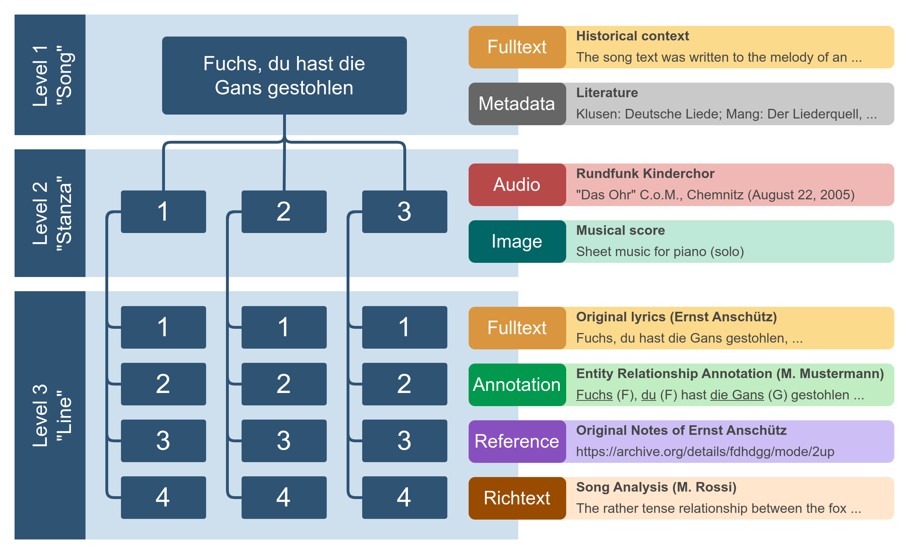
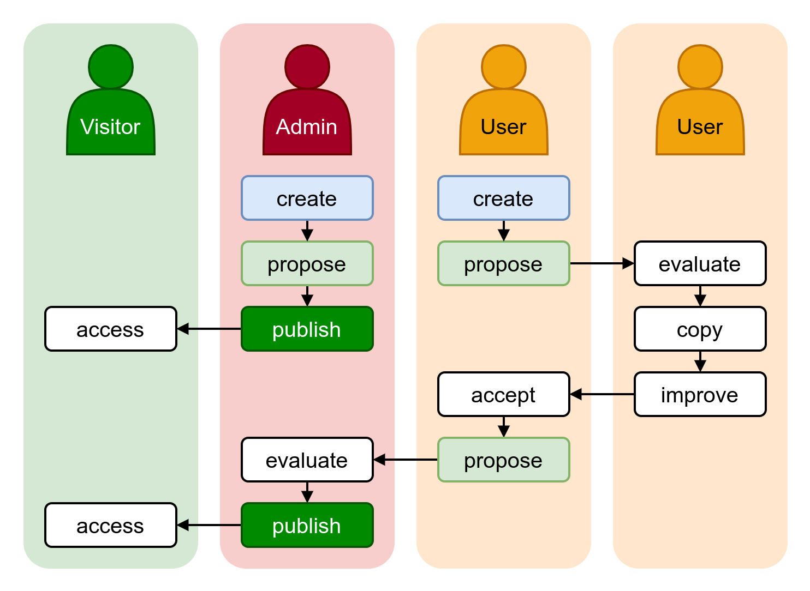

# Concepts

## Texts and structure

One instance of Tekst can handle one or more reference texts that can be selected from the user interface. Switching to a different reference text changes the working context of Tekst, including available resources, settings, etc.

Each text's structure has to be modeled in advance to lay the foundation for Tekst to work with it. The structure model of a text has to follow a clear hierarchical scheme of nested structure levels (e.g. "Series" contains "Book" contains "Chapter" contains "Paragraph" contains "Sentence").

Each structure level *must* be subordinate to *one* parent structure level and can have *at most one* direct child level. It is not possible to have two structure levels modeled as siblings under the same parent level.

!!! example
    A book's chapters may contain footnotes you'd want to model separately from the paragraphs contained in the chapters. This is not possible via the structure model. But you may very well just use a structure of "Chapter" containing "Paragraph" and associate resources containing resources on the footnotes to each location on the "Paragraph" level.

The reason for this limitation is the concept of exploratory browsing implemented by Tekst. For being able to skip through the locations on a certain structure level like you turn the pages of a book, there has to be both a clear hierarchy of structure levels as well as a sequencial order of the locations on each level.

/// caption
Data model: Example of a simple song structure modeled for use as a reference work/text in Tekst, with a selection of partly imaginary resources (the colorful boxes to the right) associated with each structure level (labeled and on the left side). A resource may provide zero to one contents per location (the nodes labeled with digits) on its respective structure level.
///

## Collaboration

Tekst aims to encourage collaboration between parties with common backgrounds or interests, like researchers working with data on the same reference text. The goal of this collaboration is the creation of a common, central platform for relevant data resources concerning one or multiple (related) texts. With Tekst, research communities are able to:

- accumulate relevant resources on one online platform
- create and propose new resources for publication
- evaluate, compare and improve data created by other community members
- publish curated datasets to the broader public (which is a decision of the party operating the platform)
- offer different ways for accessing the data, like browsing contents along the texts structure, extensive search functionalities or exporting datasets in various formats
- maintain a close network of likeminded researchers

/// caption
Collaboration flow between administrators, registered users and visitors of the platform.
///

The administrator(s) operating the platform curate the resources that are visible to public visitors. A selected community of registered users is able to create and share datasets with each other, propose corrections or additions, stay up to date on each other's progress and maintain a cooperative relationship to other representatives of their field.
