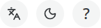

# General Guidance

These pages cover some of the basic views and functionalities of Tekst. If you have (access to) **a running instance of Tekst**, you may also look out for the help menu in the top right corner of the screen. There you will find a friendly guided tour and an overview of all of Tekst's integrated help articles:

/// caption
You'll find the help menu pointing at the question mark icon in the top right corner of the screen.
///

Otherwise, feel free to browse the articles featured in this section of the documentation.
